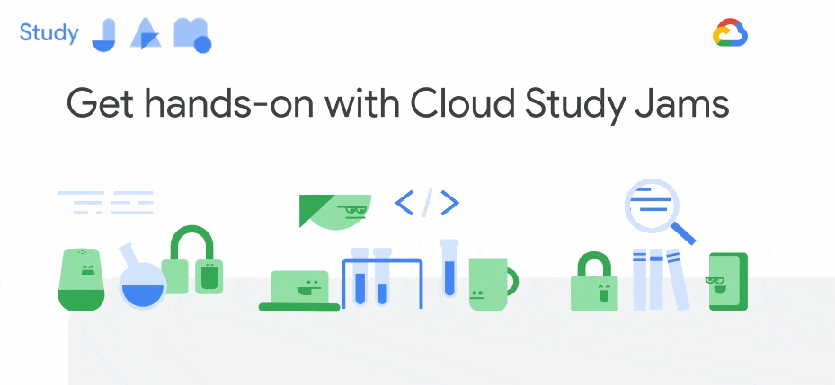

# Google Cloud Study Jam @ SUTD

Google Cloud Study Jams are community-run study groups for developers communities, supported by Google. Student volunteers run Cloud Study Jams periodically in SUTD. 

## Next up

### 5 July 2019 - GCP Essentials

| Badge | Quest |
| ----- | ----- |
|  | [GCP Essentials](https://google.qwiklabs.com/quests/23) |

In this introductory-level quest, you will get hands-on practice with the Google Cloud Platform’s fundamental tools and services. GCP Essentials is the recommended first Quest for the Google Cloud learner—you will come in with little or no prior cloud knowledge, and come out with practical experience that you can apply to your first GCP project.

**More information coming soon!**

## Previous Sessions

### 15 March 2019 - AI on GCP

| Badge | Quest |
| ----- | ----- |
|  | [Baseline: Data, ML, AI](https://run.qwiklabs.com/quests/34) |

A half-day workshop intended to introduce students to using Google Cloud Platform (GCP) tools for data and machine-learning related tasks, and is open to all members of the SUTD community.

| Photos |       |
| ------ | ----- |
|  |  |

