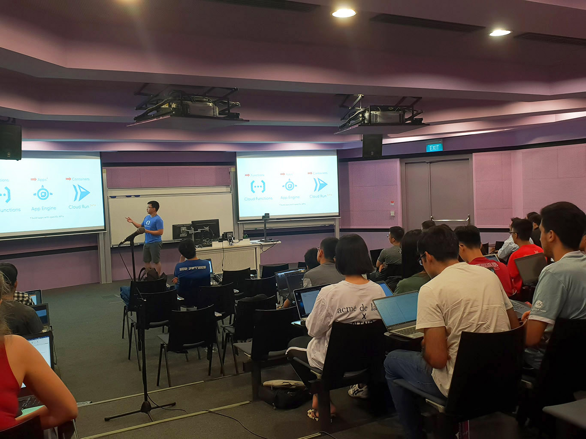

Google Cloud Study Jams are community-run study groups for developer communities. Student volunteers run Cloud Study Jams periodically in SUTD. This website will be updated with information about the next upcoming Cloud Study Jam, as well as some information about the previous ones so you can see what went on!

# Next up

## 1 November 2019 - GCP Essentials

| Badge | Quest |
| ----- | ----- |
|  | [GCP Essentials](https://google.qwiklabs.com/quests/23) |

In this introductory-level quest, you will get hands-on practice with the Google Cloud Platform’s fundamental tools and services. GCP Essentials is the recommended first Quest for the Google Cloud learner—you will come in with little or no prior cloud knowledge, and come out with practical experience that you can apply to your first GCP project:

* Google Cloud Platform Console
* Google Compute Engine
* Google Kubernetes Engine
* Network and Load Balancers

During the workshop, we will be providing you with a promo code that gives you one month free access to all the labs on QwikLabs. **All participants are expected to complete the GCP Essentials quest on QwikLabs within two weeks after the workshop.**

Venue: TBC

Time: TBC

Date: **1st November 2019**

TBC

# Previous Sessions

## 5 July 2019 - GCP Essentials

| Badge | Quest |
| ----- | ----- |
|  | [GCP Essentials](https://google.qwiklabs.com/quests/23) |

In this introductory-level quest, you will get hands-on practice with the Google Cloud Platform’s fundamental tools and services. GCP Essentials is the recommended first Quest for the Google Cloud learner—you will come in with little or no prior cloud knowledge, and come out with practical experience that you can apply to your first GCP project.

| Photos | |
| ------ | ----- |
|  |  |

## 15 March 2019 - AI on GCP

| Badge | Quest |
| ----- | ----- |
|  | [Baseline: Data, ML, AI](https://run.qwiklabs.com/quests/34) |

A half-day workshop intended to introduce students to using Google Cloud Platform (GCP) tools for data and machine-learning related tasks, and is open to all members of the SUTD community.

| Photos | |
| ------ | ----- |
|  |  |

